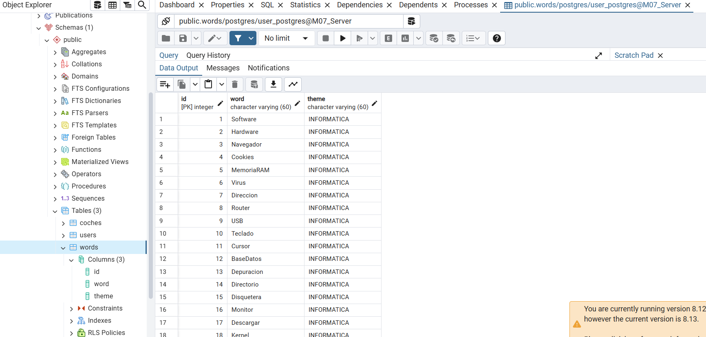
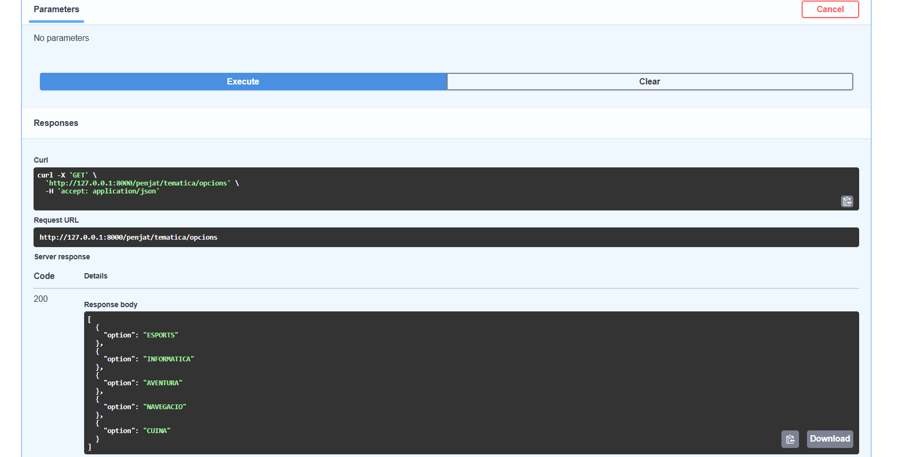
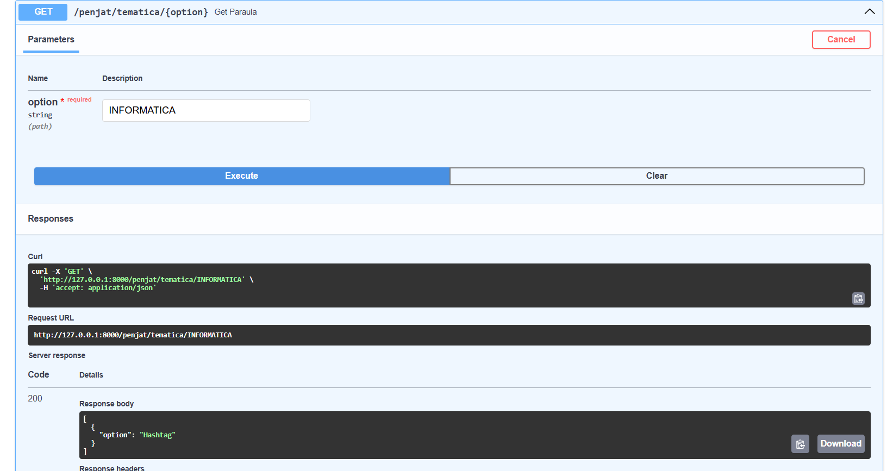
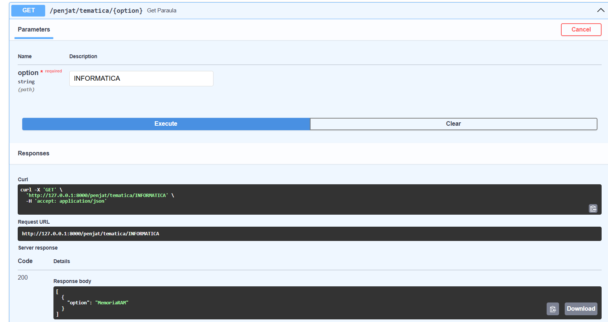

# Documentació Activitat 10

## Inserció dades a base de dades

## Primer endpoint

## Segon endpoint

He posat 2 captures de pantalla per que es pugui observar que cada vegada que s'executa dona una paraula diferent