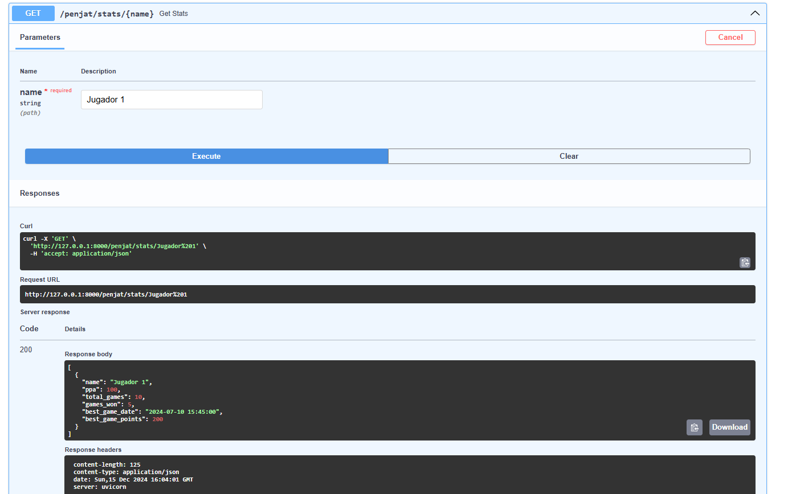

# Documentació Activitat11

## Disseny Base de dades

## Primer Endpoint

El primer y segon endpoint tenen que retornar el mateix text per tant ho fet en el mateix endpoint.

El que he fet per fer aquest endpoint es guardar en la taula words un registre amb el valor Començar partida y agafo aquest valor amb una consulta sql

## Segon Endpoint

En aquest endpoint ho tinc fet de manera que en la base de dade no tinc un camp que et digui cuants errors ha tingut l'usuari, sino que en la consulta sql faig un count per tal de saber el numero total de errors ja que en la base de dades tinc un registre per cada lletra que pulsa el usuari i en aquest registre et diu si la lletra que ha pulsat ha estat encertada o no

## Tercer Endpoint

Aquest endpoint l'utilitzo per introduir dades a la taula Attempt

## Quart Endpoint

Aquest endpoint el tinc fet de manera que hi ha que pasarli una de les opcions (es, ca, en) i et retornara una array amb totes les lletres d'aquesta llegua

## Cinquè Endpoint

En aquest endpoint tens que pasarli el nom del jugador que vulguis i et retorna les seves estadistiques

