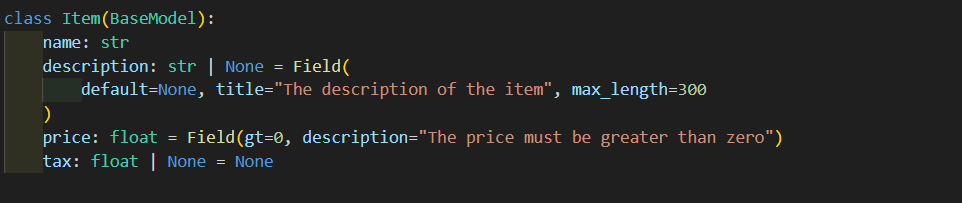
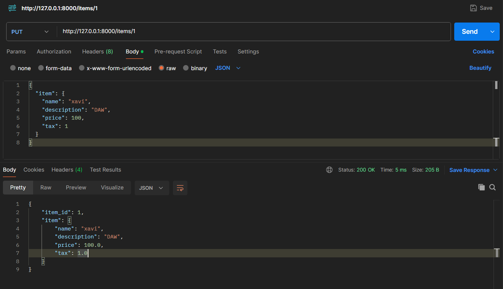

## Importar Field

Es mostra a la imatge com s'importa Field

## Declarar Field

Podem veure com s'utilitza Field

## Comprovació amb Postman

Per ultim comprovem que funciona correctament amb Postman