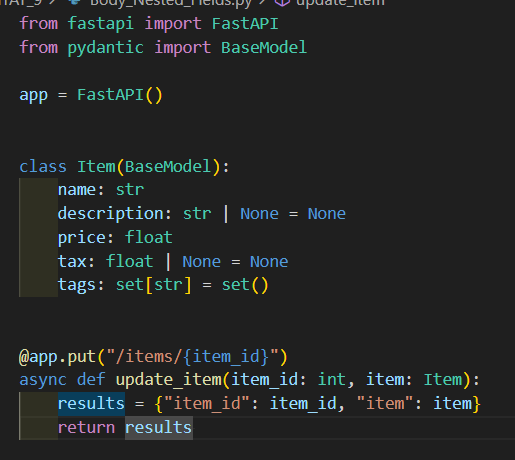

# Documentación Nested Body Fields

## Atributo como subtipo list

En este caso tags sera una lista que contendra strings, es importante antes de nada Importar List


## Atributo como subtipo set

Ahora en este caso en vez de usar una lista utiliza un set


## Definir submodelo

Aqui podemos ver que primero define un modelo Image y luego en otro modelo lo utliza el modelo anterior como atributo.


De esta manera FastApi nos devolveria algo parecido a esto:
```json
{
    "name": "Foo",
    "description": "The pretender",
    "price": 42.0,
    "tax": 3.2,
    "tags": ["rock", "metal", "bar"],
    "image": {
        "url": "http://example.com/baz.jpg",
        "name": "The Foo live"
    }
}
```


## Tipos singulares complejos

Es poden utilitzar tipus singulars més complexes en aquest cas s'utilitza http que es heredat del str, tenim que tenir en compte que hi ha que importar el modul


## Submodelo list

Aqui podemos ver como se define un submodelo y ademas que puede ser de tipo List


## Submodelos Anidados

En esta imagen podemos ver como hace el submodelo de un submodelo
